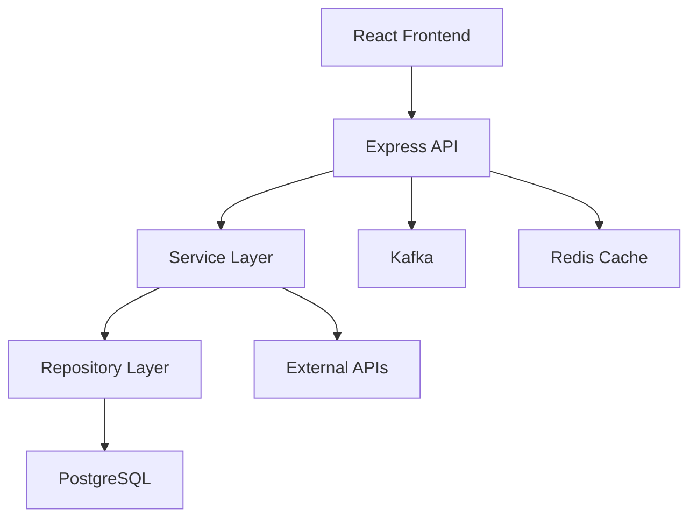

# Specialized Commands & Agents Design Proposal

**Current State**: Workflow-focused commands (analyze, plan, implement, commit, publish)
**Proposed**: Domain-specialized commands for advanced software engineering tasks

---

## Design Philosophy

### Core Principles

1. **Domain Specialization** - Each command targets a specific engineering discipline
2. **Deep Expertise** - Commands provide expert-level analysis and recommendations
3. **Context Isolation** - Maintains existing 75-95% token savings architecture
4. **Integration** - Works seamlessly with existing workflow commands
5. **Actionable Outputs** - Every command produces concrete next steps

### Three-Tier Pattern (Preserved)

```
Skills (Auto-detection)
   ↓
Commands (Orchestration)
   ↓
Subagents (Execution)
```

---

## Proposed Specialized Domains

### 1. 🐛 Debugging Domain
### 2. 🏛️ Architecture Domain
### 3. 🧪 Testing Domain
### 4. 📊 Performance Domain
### 5. 🔒 Security Domain
### 6. 📚 Documentation Domain
### 7. 👀 Code Review Domain
### 8. 🔧 Refactoring Domain

---

## 1. 🐛 DEBUGGING DOMAIN

### Command: `/schovi:debug`

**Purpose**: Systematic debugging workflow - reproduce, diagnose, fix

**Usage**:
```bash
# Debug from error message
/schovi:debug "TypeError: Cannot read property 'id' of undefined"

# Debug from Jira bug report
/schovi:debug EC-1234

# Debug from logs
/schovi:debug --logs ./error.log

# Debug with stack trace
/schovi:debug --trace "at UserService.getUser (user.ts:45)"

# Debug with reproduction steps
/schovi:debug "Login fails after password reset"
```

**Workflow**:
```
Phase 1: Error Analysis
  → Parse error message, stack trace, or bug report
  → Extract error type, location, context

Phase 2: Reproduction
  → Identify reproduction steps
  → Find affected code paths
  → Locate test cases (or note missing tests)

Phase 3: Root Cause Investigation
  → Trace execution flow backwards
  → Identify data flow issues
  → Check for common patterns (null checks, async issues, race conditions)
  → Review recent changes affecting area

Phase 4: Solution Proposals
  → Generate 2-3 fix approaches
  → Estimate risk/complexity for each
  → Recommend best approach

Phase 5: Fix Implementation (optional)
  → Apply fix with --auto-fix flag
  → Add test to prevent regression
  → Create commit with bug context
```

**Output**: `debug-[issue-id].md`
```markdown
---
error: "TypeError: Cannot read property 'id' of undefined"
location: "services/user-service.ts:45"
severity: "high"
---

# Debug Analysis: [Error Type]

## Error Context
- Location: services/user-service.ts:45
- Error: TypeError: Cannot read property 'id' of undefined
- Trigger: User login after password reset

## Root Cause
The `user` object is null when UserService.getUser() is called with
a recently reset password token. The resetPassword() method invalidates
the session but doesn't handle the edge case where...

## Reproduction
1. User resets password
2. Click reset link
3. Login with new password
4. Error occurs in user-service.ts:45

## Affected Code
- services/user-service.ts:45 (null check missing)
- auth/reset-password.ts:89 (session invalidation)
- models/user.ts:23 (user lookup)

## Solution Options

### Option 1: Add null check (Recommended)
✅ Simple, low risk
✅ Quick fix (5 min)
⚠️ Defensive programming

### Option 2: Fix session invalidation
✅ Addresses root cause
⚠️ Complex, affects multiple flows

### Option 3: Add validation layer
✅ Prevents similar issues
⚠️ Requires refactoring

## Recommended Fix
Add null check at user-service.ts:45 + add test case

## Test Case to Add
```typescript
it('should handle null user after password reset', () => {
  // Test case implementation
});
```
```

**Flags**:
- `--auto-fix` - Automatically apply recommended fix
- `--logs PATH` - Parse logs for error context
- `--trace TEXT` - Provide stack trace
- `--severity [critical|high|medium|low]` - Override severity
- `--interactive` - Ask questions to narrow down issue

**Supporting Subagents**:
- `error-analyzer` - Parse error messages, stack traces
- `stack-tracer` - Follow execution paths
- `test-finder` - Locate related test cases
- `git-blame-analyzer` - Find recent changes affecting area
- `pattern-detector` - Detect common bug patterns

---

### Command: `/schovi:trace`

**Purpose**: Trace code execution paths and data flow

**Usage**:
```bash
# Trace function calls
/schovi:trace UserService.getUser

# Trace data flow
/schovi:trace --data "user object" --from login --to database

# Trace async operations
/schovi:trace --async processPayment
```

**Output**: Visual execution trace diagram

---

### Command: `/schovi:reproduce`

**Purpose**: Generate reproduction steps for bugs

**Usage**:
```bash
# From bug report
/schovi:reproduce EC-1234

# From error
/schovi:reproduce "Payment fails on mobile"
```

**Output**: Step-by-step reproduction guide with test case

---

## 2. 🏛️ ARCHITECTURE DOMAIN

### Command: `/schovi:architecture`

**Purpose**: Analyze and document software architecture

**Usage**:
```bash
# Analyze entire codebase
/schovi:architecture

# Analyze specific module
/schovi:architecture --module payments

# Generate architecture diagram
/schovi:architecture --diagram --output arch.mmd

# Review architecture decisions
/schovi:architecture --review

# Check for anti-patterns
/schovi:architecture --anti-patterns
```

**Workflow**:
```
Phase 1: Structure Discovery
  → Identify modules, services, components
  → Map dependencies
  → Detect architectural patterns

Phase 2: Pattern Recognition
  → Identify design patterns in use
  → Detect architectural style (microservices, monolith, etc.)
  → Find layering structure

Phase 3: Analysis
  → Evaluate modularity
  → Check separation of concerns
  → Identify tight coupling
  → Find circular dependencies

Phase 4: Documentation Generation
  → Create architecture diagrams (Mermaid)
  → Document major components
  → Explain data flows
  → List integration points

Phase 5: Recommendations
  → Suggest improvements
  → Identify refactoring opportunities
  → Recommend patterns for new features
```

**Output**: `architecture-analysis.md` + `architecture.mmd`
```markdown
# Architecture Analysis

## Overview
This codebase follows a **layered monolith** architecture with clear
separation between presentation, business logic, and data layers.

## Components

### Frontend Layer
- React SPA (src/components/)
- State management: Redux (src/store/)
- API client: Axios (src/api/)

### Backend Layer
- Express API (api/routes/)
- Business logic: Services (api/services/)
- Data access: Repositories (api/repositories/)
- Database: PostgreSQL (via TypeORM)

### Integration Layer
- External APIs: Jira, GitHub, Datadog
- Message queue: Kafka (events/)
- Cache: Redis (cache/)

## Architecture Diagram



## Patterns Detected

✅ **Repository Pattern** - Data access abstraction (api/repositories/)
✅ **Service Layer** - Business logic encapsulation (api/services/)
✅ **Dependency Injection** - Loose coupling (api/container.ts)
⚠️ **God Object** - UserService has 47 methods (api/services/user-service.ts)
❌ **Circular Dependency** - Orders ↔ Payments (api/services/)

## Quality Metrics

- **Modularity**: 7/10 (good separation, some coupling)
- **Testability**: 6/10 (DI helps, but complex dependencies)
- **Scalability**: 5/10 (monolith limits horizontal scaling)
- **Maintainability**: 7/10 (clear structure, some technical debt)

## Recommendations

### High Priority
1. **Break up UserService** - 47 methods is too many
   - Split into: UserAuthService, UserProfileService, UserPreferenceService

2. **Resolve Circular Dependency** - Orders ↔ Payments
   - Create OrderPaymentOrchestrator as mediator

### Medium Priority
3. **Add API Gateway** - Centralize auth, rate limiting
4. **Extract Read Models** - CQRS for reporting queries

### Low Priority
5. **Consider Microservices** - For payments and billing domains
```

**Flags**:
- `--module NAME` - Analyze specific module
- `--diagram` - Generate architecture diagram
- `--anti-patterns` - Focus on anti-patterns only
- `--review` - Review against best practices
- `--compare PATH` - Compare with another architecture

**Supporting Subagents**:
- `structure-analyzer` - Map codebase structure
- `dependency-mapper` - Create dependency graphs
- `pattern-detector` - Identify design patterns
- `diagram-generator` - Generate Mermaid diagrams
- `architecture-evaluator` - Score against best practices

---

### Command: `/schovi:deps`

**Purpose**: Deep dependency analysis

**Usage**:
```bash
# Analyze all dependencies
/schovi:deps

# Find circular dependencies
/schovi:deps --circular

# Analyze specific module
/schovi:deps --module payments

# Generate dependency graph
/schovi:deps --graph
```

**Output**: Dependency graph + circular dependency report

---

### Command: `/schovi:design-patterns`

**Purpose**: Identify and recommend design patterns

**Usage**:
```bash
# Identify patterns in use
/schovi:design-patterns

# Recommend patterns for feature
/schovi:design-patterns "notification system"

# Check pattern implementation
/schovi:design-patterns --check Observer --in ./events
```

---

## 3. 🧪 TESTING DOMAIN

### Command: `/schovi:test-gen`

**Purpose**: Intelligent test generation

**Usage**:
```bash
# Generate tests for file
/schovi:test-gen src/services/user-service.ts

# Generate tests for feature
/schovi:test-gen --feature "payment processing"

# Generate missing tests
/schovi:test-gen --coverage --min 80

# Generate integration tests
/schovi:test-gen --integration --api

# Generate E2E scenarios
/schovi:test-gen --e2e --flow "checkout"
```

**Workflow**:
```
Phase 1: Code Analysis
  → Parse source code
  → Identify public methods/functions
  → Extract parameters and return types
  → Find edge cases

Phase 2: Coverage Analysis
  → Check existing tests
  → Identify untested paths
  → Calculate current coverage

Phase 3: Test Generation
  → Generate unit tests for untested methods
  → Create integration tests for APIs
  → Design E2E scenarios for user flows
  → Add edge case tests

Phase 4: Test Implementation
  → Write test code
  → Create mocks/stubs
  → Setup test data
  → Add assertions

Phase 5: Validation
  → Run generated tests
  → Fix any failures
  → Verify coverage improvement
```

**Output**: Test files + coverage report
```typescript
// user-service.spec.ts (generated)

describe('UserService', () => {
  let userService: UserService;
  let mockUserRepo: jest.Mocked<UserRepository>;

  beforeEach(() => {
    mockUserRepo = createMockUserRepository();
    userService = new UserService(mockUserRepo);
  });

  describe('getUser', () => {
    it('should return user when found', async () => {
      // Arrange
      const userId = '123';
      const expectedUser = { id: userId, name: 'John' };
      mockUserRepo.findById.mockResolvedValue(expectedUser);

      // Act
      const result = await userService.getUser(userId);

      // Assert
      expect(result).toEqual(expectedUser);
      expect(mockUserRepo.findById).toHaveBeenCalledWith(userId);
    });

    it('should throw error when user not found', async () => {
      // Arrange
      const userId = 'nonexistent';
      mockUserRepo.findById.mockResolvedValue(null);

      // Act & Assert
      await expect(userService.getUser(userId))
        .rejects.toThrow('User not found');
    });

    it('should handle null userId', async () => {
      // Act & Assert
      await expect(userService.getUser(null))
        .rejects.toThrow('Invalid userId');
    });

    // ... more edge cases
  });

  // ... more methods
});
```

**Flags**:
- `--coverage` - Focus on improving coverage
- `--min N` - Minimum coverage percentage target
- `--integration` - Generate integration tests
- `--e2e` - Generate E2E scenarios
- `--feature NAME` - Test specific feature
- `--auto-run` - Run tests after generation

**Supporting Subagents**:
- `code-parser` - Extract testable units
- `coverage-analyzer` - Analyze test coverage
- `test-generator` - Generate test code
- `mock-generator` - Create mocks/stubs
- `edge-case-detector` - Find edge cases

---

### Command: `/schovi:test-review`

**Purpose**: Review test quality and coverage

**Usage**:
```bash
# Review all tests
/schovi:test-review

# Review specific test file
/schovi:test-review tests/user-service.spec.ts

# Check for test smells
/schovi:test-review --smells
```

---

## 4. 📊 PERFORMANCE DOMAIN

### Command: `/schovi:perf`

**Purpose**: Performance analysis and optimization

**Usage**:
```bash
# Analyze performance hotspots
/schovi:perf

# Profile specific function
/schovi:perf --function processPayment

# Analyze database queries
/schovi:perf --database

# Find N+1 queries
/schovi:perf --n-plus-one

# Memory leak detection
/schovi:perf --memory

# Bundle size analysis
/schovi:perf --bundle
```

**Workflow**:
```
Phase 1: Profiling
  → Identify performance hotspots
  → Measure function execution times
  → Analyze memory usage
  → Track database query performance

Phase 2: Issue Detection
  → Find N+1 query problems
  → Detect slow algorithms (O(n²), etc.)
  → Identify memory leaks
  → Find blocking operations

Phase 3: Impact Analysis
  → Estimate performance impact
  → Measure user-facing latency
  → Calculate resource costs

Phase 4: Optimization Recommendations
  → Suggest caching strategies
  → Recommend query optimizations
  → Propose algorithm improvements
  → Identify lazy loading opportunities

Phase 5: Implementation (optional)
  → Apply optimizations with --apply flag
  → Add performance tests
  → Benchmark improvements
```

**Output**: `performance-report.md`
```markdown
# Performance Analysis Report

## Executive Summary
- ⚠️ 3 critical performance issues found
- 💡 12 optimization opportunities identified
- 📈 Estimated improvement: 45% faster response times

## Critical Issues

### 1. N+1 Query in Order List (CRITICAL)
**Location**: `api/services/order-service.ts:67`
**Impact**: 200+ database queries per request
**User Impact**: 2.5s page load time

**Current Code**:
```typescript
const orders = await orderRepo.findAll(); // 1 query
for (const order of orders) {
  order.items = await orderItemRepo.findByOrderId(order.id); // N queries
}
```

**Optimized Code**:
```typescript
const orders = await orderRepo.findAllWithItems(); // 1 query with JOIN
```

**Expected Improvement**: 2.5s → 0.3s (83% faster)

### 2. Synchronous File I/O in Request Handler (HIGH)
**Location**: `api/routes/export.ts:34`
**Impact**: Blocks event loop
**User Impact**: Entire server stalls during export

**Fix**: Use async file operations or queue system

### 3. Unbounded Array Growth (HIGH)
**Location**: `services/cache-service.ts:89`
**Impact**: Memory leak
**User Impact**: Server crashes after ~6 hours

**Fix**: Add cache eviction policy (LRU with max size)

## Optimization Opportunities

### Database
- Add index on `orders.user_id` (10x faster user order queries)
- Use connection pooling (currently 1 connection)
- Cache frequent queries (user preferences, settings)

### Algorithms
- Replace O(n²) sort in product-filter.ts:45 with O(n log n)
- Use Map instead of Array.find() in user-lookup.ts:23

### Caching
- Add Redis cache for user sessions (reduce DB load by 40%)
- Cache expensive computations in analytics service

### Bundle Optimization
- Code-split large dependencies (moment.js, lodash)
- Lazy load admin dashboard components
- Tree-shake unused exports

## Performance Metrics

| Endpoint | Before | After (Est.) | Improvement |
|----------|--------|--------------|-------------|
| GET /orders | 2.5s | 0.3s | 83% |
| GET /products | 850ms | 120ms | 86% |
| POST /checkout | 1.2s | 400ms | 67% |

## Implementation Plan

### Phase 1: Critical Fixes (Week 1)
1. Fix N+1 queries in orders
2. Add async file I/O
3. Fix memory leak in cache

### Phase 2: Database Optimization (Week 2)
4. Add missing indexes
5. Implement connection pooling
6. Add query caching

### Phase 3: Algorithm Improvements (Week 3)
7. Optimize sorting algorithms
8. Replace inefficient lookups
9. Add caching layer
```

**Flags**:
- `--function NAME` - Profile specific function
- `--database` - Focus on database performance
- `--n-plus-one` - Find N+1 query issues
- `--memory` - Memory leak detection
- `--bundle` - Bundle size analysis
- `--apply` - Auto-apply optimizations

**Supporting Subagents**:
- `profiler` - Profile code execution
- `query-analyzer` - Analyze database queries
- `complexity-analyzer` - Detect algorithmic issues
- `memory-analyzer` - Find memory leaks
- `bundle-analyzer` - Analyze bundle size

---

### Command: `/schovi:benchmark`

**Purpose**: Create and run performance benchmarks

**Usage**:
```bash
# Benchmark function
/schovi:benchmark --function sortUsers

# Compare implementations
/schovi:benchmark --compare "bubble sort vs quick sort"
```

---

## 5. 🔒 SECURITY DOMAIN

### Command: `/schovi:security`

**Purpose**: Security audit and vulnerability detection

**Usage**:
```bash
# Full security audit
/schovi:security

# Check for specific vulnerability
/schovi:security --check sql-injection

# Audit dependencies
/schovi:security --deps

# Check authentication/authorization
/schovi:security --auth

# Scan for secrets
/schovi:security --secrets
```

**Workflow**:
```
Phase 1: Vulnerability Scanning
  → SQL injection vulnerabilities
  → XSS vulnerabilities
  → CSRF protection
  → Authentication issues
  → Authorization flaws

Phase 2: Dependency Audit
  → Known CVEs in dependencies
  → Outdated packages
  → License issues

Phase 3: Code Analysis
  → Hardcoded secrets
  → Insecure cryptography
  → Unsafe deserialization
  → Path traversal

Phase 4: Configuration Review
  → CORS configuration
  → Security headers
  → TLS/SSL settings

Phase 5: Recommendations
  → Prioritized fix list
  → Security best practices
  → Compliance requirements
```

**Output**: `security-audit.md`
```markdown
# Security Audit Report

## Summary
- 🔴 2 critical vulnerabilities
- 🟡 5 high-priority issues
- 🟢 12 medium-priority recommendations

## Critical Vulnerabilities

### 1. SQL Injection in Search (CRITICAL - CVE)
**Location**: `api/routes/search.ts:34`
**Risk**: Remote code execution, data breach

**Vulnerable Code**:
```typescript
const query = `SELECT * FROM users WHERE name LIKE '%${searchTerm}%'`;
const results = await db.query(query);
```

**Attack Vector**:
```
searchTerm = "'; DROP TABLE users; --"
```

**Fix**:
```typescript
const query = 'SELECT * FROM users WHERE name LIKE $1';
const results = await db.query(query, [`%${searchTerm}%`]);
```

**Priority**: FIX IMMEDIATELY

### 2. Missing Authentication on Admin Endpoint (CRITICAL)
**Location**: `api/routes/admin.ts:12-45`
**Risk**: Unauthorized access to admin functions

**Vulnerable Code**:
```typescript
router.delete('/users/:id', async (req, res) => {
  // No auth check!
  await userService.deleteUser(req.params.id);
});
```

**Fix**: Add authentication middleware

## High-Priority Issues

### 3. Hardcoded API Keys (HIGH)
**Locations**:
- `config/secrets.ts:8` - Stripe API key
- `services/email.ts:12` - SendGrid API key

**Fix**: Move to environment variables

### 4. Weak Password Hashing (HIGH)
**Location**: `auth/password.ts:23`
**Issue**: Using MD5 instead of bcrypt

**Fix**:
```typescript
// Replace MD5
const hashedPassword = crypto.createHash('md5')
  .update(password).digest('hex');

// With bcrypt
const hashedPassword = await bcrypt.hash(password, 12);
```

## Dependency Vulnerabilities

| Package | Version | CVE | Severity | Fix |
|---------|---------|-----|----------|-----|
| lodash | 4.17.15 | CVE-2020-8203 | High | Upgrade to 4.17.21 |
| axios | 0.19.2 | CVE-2021-3749 | Medium | Upgrade to 1.2.0 |

## Security Headers Missing

```
❌ Content-Security-Policy
❌ X-Frame-Options
❌ X-Content-Type-Options
⚠️ Strict-Transport-Security (partially configured)
```

**Recommendation**: Add helmet.js middleware

## Compliance Issues

### GDPR
- ⚠️ No data retention policy defined
- ⚠️ User deletion not fully implemented
- ✅ Consent tracking present

### OWASP Top 10
- ✅ A01: Broken Access Control - Mostly covered
- 🔴 A02: Cryptographic Failures - Weak hashing detected
- 🔴 A03: Injection - SQL injection found
- ✅ A04: Insecure Design - Good architecture
- 🟡 A05: Security Misconfiguration - Headers missing
- ✅ A06: Vulnerable Components - Few outdated deps
- 🟡 A07: Auth Failures - Some issues found
- ✅ A08: Data Integrity - Good validation
- 🟡 A09: Logging Failures - Incomplete logging
- ✅ A10: SSRF - Not applicable

## Action Items

### Immediate (This Week)
1. Fix SQL injection in search
2. Add auth to admin endpoints
3. Move hardcoded keys to env vars

### Short Term (This Month)
4. Upgrade vulnerable dependencies
5. Implement bcrypt password hashing
6. Add security headers

### Long Term (This Quarter)
7. Implement security logging
8. Add rate limiting
9. Complete GDPR compliance
```

**Flags**:
- `--check TYPE` - Check specific vulnerability type
- `--deps` - Audit dependencies only
- `--auth` - Focus on authentication/authorization
- `--secrets` - Scan for hardcoded secrets
- `--compliance STANDARD` - Check compliance (OWASP, GDPR, etc.)

**Supporting Subagents**:
- `vulnerability-scanner` - Detect common vulnerabilities
- `dependency-auditor` - Check dependency CVEs
- `secret-scanner` - Find hardcoded secrets
- `auth-analyzer` - Review authentication/authorization
- `compliance-checker` - Verify compliance requirements

---

## 6. 📚 DOCUMENTATION DOMAIN

### Command: `/schovi:docs`

**Purpose**: Generate and maintain documentation

**Usage**:
```bash
# Generate API docs
/schovi:docs --api

# Generate architecture docs
/schovi:docs --architecture

# Generate changelog
/schovi:docs --changelog

# Update README
/schovi:docs --readme

# Generate ADRs
/schovi:docs --adr "Use PostgreSQL"
```

**Workflow**:
```
Phase 1: Code Analysis
  → Extract public APIs
  → Identify components
  → Parse JSDoc/comments

Phase 2: Structure Detection
  → Identify modules
  → Map relationships
  → Find integration points

Phase 3: Documentation Generation
  → API reference
  → Architecture diagrams
  → Usage examples
  → Getting started guide

Phase 4: Maintenance
  → Update existing docs
  → Generate changelogs
  → Create migration guides
```

**Output**: Various documentation files

---

### Command: `/schovi:adr`

**Purpose**: Create Architecture Decision Records

**Usage**:
```bash
# Create new ADR
/schovi:adr "Use PostgreSQL for main database"

# List ADRs
/schovi:adr --list

# Review ADR
/schovi:adr --review 001-database-choice
```

---

## 7. 👀 CODE REVIEW DOMAIN

### Command: `/schovi:review`

**Purpose**: Automated code review with expert insights

**Usage**:
```bash
# Review current changes
/schovi:review

# Review specific PR
/schovi:review #123

# Review specific file
/schovi:review src/services/user-service.ts

# Focus on specific aspect
/schovi:review --security
/schovi:review --performance
/schovi:review --maintainability
```

**Workflow**:
```
Phase 1: Change Analysis
  → Identify modified files
  → Parse diffs
  → Categorize changes

Phase 2: Multi-Aspect Review
  → Code quality (style, complexity, readability)
  → Security (vulnerabilities, best practices)
  → Performance (inefficiencies, optimizations)
  → Testing (coverage, test quality)
  → Architecture (patterns, coupling)

Phase 3: Issue Detection
  → Find bugs
  → Detect code smells
  → Identify anti-patterns
  → Spot potential issues

Phase 4: Recommendations
  → Specific improvement suggestions
  → Code examples
  → Priority ranking
```

**Output**: `review-report.md`
```markdown
# Code Review Report

## Summary
- 📊 Files changed: 8
- 🔴 Issues found: 3 critical, 7 high, 12 medium
- ✅ Good practices: 5

## Critical Issues

### 1. Unhandled Promise Rejection
**File**: `src/services/payment-service.ts:89`
**Severity**: Critical

```typescript
// Current (dangerous)
async processPayment(orderId: string) {
  const payment = await paymentGateway.charge(orderId);
  // No error handling!
  return payment;
}

// Recommended
async processPayment(orderId: string) {
  try {
    const payment = await paymentGateway.charge(orderId);
    return payment;
  } catch (error) {
    logger.error('Payment failed', { orderId, error });
    throw new PaymentError('Payment processing failed', error);
  }
}
```

### 2. God Class - UserService
**File**: `src/services/user-service.ts`
**Issue**: 47 methods in single class

**Recommendation**: Split into smaller, focused services:
- UserAuthService (login, logout, token management)
- UserProfileService (profile CRUD)
- UserPreferenceService (settings, preferences)

## High-Priority Issues

### 3. Missing Input Validation
**File**: `src/api/routes/users.ts:34`

```typescript
// Missing validation
router.post('/users', async (req, res) => {
  const user = await userService.create(req.body);
  res.json(user);
});

// Add validation
router.post('/users',
  validate(userCreateSchema), // Add this
  async (req, res) => {
    const user = await userService.create(req.body);
    res.json(user);
  }
);
```

## Good Practices Observed

✅ **Dependency Injection** - Properly implemented in services/
✅ **Type Safety** - Good TypeScript usage, minimal `any`
✅ **Error Handling** - Most async operations have try-catch
✅ **Testing** - Good test coverage (78%)
✅ **Documentation** - JSDoc comments present

## Recommendations by Priority

### Must Fix (Before Merge)
1. Add error handling to payment processing
2. Add input validation to user creation endpoint
3. Fix type safety issues in auth middleware

### Should Fix (This Sprint)
4. Refactor UserService (too large)
5. Add missing test cases for edge scenarios
6. Improve error messages for better debugging

### Nice to Have
7. Extract magic numbers to constants
8. Add JSDoc to exported functions
9. Improve variable naming in loops
```

**Flags**:
- `--security` - Focus on security issues
- `--performance` - Focus on performance
- `--maintainability` - Focus on code quality
- `--auto` - Auto-fix safe issues

**Supporting Subagents**:
- `diff-analyzer` - Parse code changes
- `quality-analyzer` - Check code quality metrics
- `security-reviewer` - Find security issues
- `performance-reviewer` - Detect performance problems
- `test-reviewer` - Review test coverage and quality

---

## 8. 🔧 REFACTORING DOMAIN

### Command: `/schovi:refactor`

**Purpose**: Systematic refactoring with safety checks

**Usage**:
```bash
# Refactor specific code smell
/schovi:refactor --smell "long method" --file user-service.ts

# Extract function
/schovi:refactor --extract-function --lines 45-67

# Extract class
/schovi:refactor --extract-class UserValidator

# Rename across codebase
/schovi:refactor --rename getUserData getUser

# Apply design pattern
/schovi:refactor --pattern Strategy --file discount-calculator.ts
```

**Workflow**:
```
Phase 1: Code Smell Detection
  → Identify refactoring opportunities
  → Categorize by type and severity
  → Estimate impact

Phase 2: Refactoring Plan
  → Choose refactoring strategy
  → Identify affected code
  → Plan step-by-step changes

Phase 3: Safety Analysis
  → Find test coverage
  → Identify breaking changes
  → Check for side effects

Phase 4: Execution
  → Apply refactoring
  → Update tests
  → Verify no behavior change

Phase 5: Validation
  → Run tests
  → Check type safety
  → Verify no regressions
```

**Output**: Refactored code + refactoring report

---

## Integration with Existing Workflow

### How Specialized Commands Integrate

```
Traditional Workflow:
  analyze → plan → implement → commit → publish

Enhanced Workflow:
  analyze → [debug/architecture/security/perf review]
         → plan → [test-gen/docs preparation]
         → implement → [test-gen/review/refactor]
         → commit → [review final checks]
         → publish

Example: Bug Fix with Debugging
  1. /schovi:debug EC-1234          # Diagnose issue
  2. /schovi:analyze EC-1234        # Full problem analysis
  3. /schovi:plan EC-1234           # Create fix spec
  4. /schovi:implement              # Apply fix
  5. /schovi:test-gen --coverage    # Ensure test coverage
  6. /schovi:review                 # Self-review
  7. /schovi:commit                 # Create commit
  8. /schovi:publish                # Create PR

Example: Performance Optimization
  1. /schovi:perf                   # Find hotspots
  2. /schovi:analyze --input perf-report.md
  3. /schovi:plan                   # Plan optimizations
  4. /schovi:implement              # Apply optimizations
  5. /schovi:benchmark              # Verify improvements
  6. /schovi:commit
  7. /schovi:publish

Example: Security Fix
  1. /schovi:security               # Security audit
  2. /schovi:analyze --input security-audit.md
  3. /schovi:plan                   # Plan fixes
  4. /schovi:implement              # Fix vulnerabilities
  5. /schovi:security --verify      # Re-audit
  6. /schovi:commit
  7. /schovi:publish
```

---

## Priority Recommendations

### Phase 1: Essential Commands (Implement First)

1. **`/schovi:debug`** - High value, clear use case
2. **`/schovi:test-gen`** - Automates tedious work
3. **`/schovi:review`** - Improves code quality

### Phase 2: Architecture Commands

4. **`/schovi:architecture`** - Understand codebases faster
5. **`/schovi:deps`** - Find architectural issues

### Phase 3: Advanced Commands

6. **`/schovi:perf`** - Performance optimization
7. **`/schovi:security`** - Critical for production code
8. **`/schovi:refactor`** - Systematic improvements

### Phase 4: Supporting Commands

9. **`/schovi:docs`** - Documentation automation
10. **`/schovi:trace`**, `/schovi:benchmark`, etc. - Specialized utilities

---

## Implementation Strategy

### 1. Start with Debug Command (Highest ROI)

**Week 1-2**: Implement `/schovi:debug`
- Create error-analyzer subagent
- Create stack-tracer subagent
- Implement debug workflow
- Test with real bugs

### 2. Add Test Generation (High Value)

**Week 3-4**: Implement `/schovi:test-gen`
- Create code-parser subagent
- Create test-generator subagent
- Generate unit tests
- Integrate with existing workflow

### 3. Build Architecture Analysis

**Week 5-6**: Implement `/schovi:architecture`
- Create structure-analyzer subagent
- Create dependency-mapper subagent
- Generate architecture diagrams
- Document findings

### 4. Continue with Remaining Commands

**Weeks 7-16**: Implement remaining specialized commands
- Performance domain
- Security domain
- Review domain
- Refactoring domain
- Documentation domain

---

## Summary

**Proposed**: 20+ specialized commands across 8 domains

**Core Domains**:
1. 🐛 Debugging - debug, trace, reproduce
2. 🏛️ Architecture - architecture, deps, design-patterns
3. 🧪 Testing - test-gen, test-review
4. 📊 Performance - perf, benchmark
5. 🔒 Security - security (audit, scan)
6. 📚 Documentation - docs, adr
7. 👀 Code Review - review
8. 🔧 Refactoring - refactor

**Benefits**:
- ✅ Specialized expertise for each domain
- ✅ Deep analysis beyond general-purpose tools
- ✅ Actionable outputs (not just reports)
- ✅ Integrated with existing workflow
- ✅ Maintains context isolation architecture

**Next Steps**:
1. Review and prioritize commands
2. Start with debug command (pilot)
3. Validate architecture with one domain
4. Scale to remaining domains
